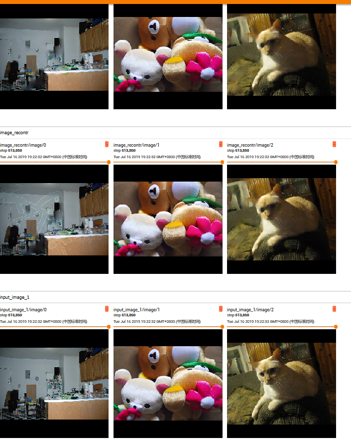

# PConv-tf
Unofficial implementation of ["Image Inpainting for Irregular Holes Using Partial Convolutions"](https://arxiv.org/abs/1804.07723) by Tensorflow and tf-keras

---

## Requirements(for reference only)
* python                          3.6.5
* tensorflow-gpu                  1.13.1
* opencv-python                   4.0.0.21
* numpy                           1.15.4
* Pillow                          5.1.0

## Configuration
Training hyperparameters configuration can be writen in a json file.For example:
```json
{
    "num_epoches": 30,
    "batch_size": 4, 
    "image_size": 512, 
    "data_path": 
    "/data/train2017/"
}
```
Instead of using any configuration file, you can also configurate by assigning arguments.You can check some details in origin paper.

## Training
I use MSCOCO 2017 as training set.If you assgin your training hyper-parameters in json file, then you can run the following command in your command line:
``` bash
python train.py --config <configuration file>
```
or you can assign arguments directly:
``` bash
python train.py --num_epoch 30 --batch_size 4 --image_size 256 --data_path <your training set path>
```
Notice that some default values are set, you can ignore where the your argument value is the same with the default value!But `data_path` can not be None!

## Test
Test script is available!You can run the `test.py` and test your model following the prompt.
NOTICE: please rename your input image with beginning `image_`, the mask map which prefix `mask_` and the same suffix with the input image will be used. 

## Demo


## Exporting Model
In default setting, checkpoint file will be save ever 10000 steps, default store path is './model'. The .pb file will export at the end of each epoch, instead of using global step as the suffix in checkpoints, .pb files use epoch numbers.

## Contact
Welcome discussing about the codes and reporting bugs!<br />
{
  author:liangliqiang@126.com
}
